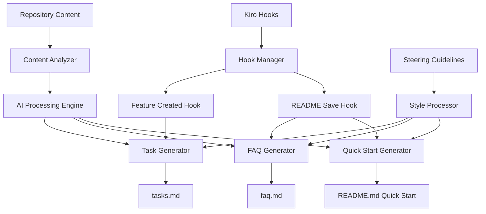

# Design Document

## Overview

SpecOps is designed as a modular AI-powered onboarding factory that leverages Kiro's hook system and file analysis capabilities. The system follows a pipeline architecture where content analysis feeds into multiple generation engines (tasks, FAQs, Quick Start) that produce structured documentation. The design emphasizes extensibility, maintainability, and integration with existing development workflows.

## Architecture

### High-Level Architecture



### Core Components

1. **Content Analyzer**: Parses and extracts semantic information from Markdown files
2. **AI Processing Engine**: Leverages language models to understand content and generate insights
3. **Generation Engines**: Specialized modules for creating tasks, FAQs, and Quick Start content
4. **Hook Manager**: Coordinates automatic triggers and content updates
5. **Style Processor**: Ensures all generated content follows steering guidelines

## Components and Interfaces

### Content Analyzer

**Purpose**: Extract structured information from repository Markdown content

**Interface**:
```python
class ContentAnalyzer:
    def analyze_repository(self, repo_path: str) -> RepositoryAnalysis
    def extract_concepts(self, markdown_content: str) -> List[Concept]
    def identify_setup_steps(self, content: str) -> List[SetupStep]
    def find_code_examples(self, content: str) -> List[CodeExample]
```

**Key Responsibilities**:
- Parse Markdown files and extract semantic content
- Identify key concepts, setup instructions, and workflow patterns
- Maintain content relationships and dependencies
- Cache analysis results for performance

### AI Processing Engine

**Purpose**: Transform analyzed content into actionable insights using AI

**Interface**:
```python
class AIProcessingEngine:
    def generate_task_suggestions(self, analysis: RepositoryAnalysis) -> List[TaskSuggestion]
    def create_faq_pairs(self, analysis: RepositoryAnalysis) -> List[FAQPair]
    def extract_quick_start_steps(self, analysis: RepositoryAnalysis) -> QuickStartGuide
    def analyze_feature_code(self, feature_path: str) -> FeatureAnalysis
```

**Key Responsibilities**:
- Process analyzed content through AI models
- Generate contextually relevant suggestions
- Maintain consistency in tone and style
- Handle error cases and fallbacks

### Task Generator

**Purpose**: Create structured onboarding tasks from AI insights

**Interface**:
```python
class TaskGenerator:
    def generate_onboarding_tasks(self, suggestions: List[TaskSuggestion]) -> TaskDocument
    def append_feature_tasks(self, feature_analysis: FeatureAnalysis, existing_tasks: TaskDocument) -> TaskDocument
    def format_tasks_markdown(self, tasks: TaskDocument) -> str
```

**Key Responsibilities**:
- Convert AI suggestions into structured tasks
- Maintain task numbering and hierarchy
- Ensure tasks build incrementally
- Reference source documentation appropriately

### FAQ Generator

**Purpose**: Create comprehensive FAQ content from repository analysis

**Interface**:
```python
class FAQGenerator:
    def generate_faqs(self, faq_pairs: List[FAQPair]) -> FAQDocument
    def merge_with_existing(self, new_faqs: FAQDocument, existing_path: str) -> FAQDocument
    def format_faq_markdown(self, faqs: FAQDocument) -> str
```

**Key Responsibilities**:
- Generate question-answer pairs from content analysis
- Merge with existing FAQ content
- Maintain consistent formatting and organization
- Avoid duplicate questions

### Quick Start Generator

**Purpose**: Create and update README Quick Start sections

**Interface**:
```python
class QuickStartGenerator:
    def generate_quick_start(self, guide: QuickStartGuide) -> str
    def update_readme_section(self, readme_path: str, quick_start_content: str) -> None
    def preserve_existing_content(self, readme_content: str) -> str
```

**Key Responsibilities**:
- Generate concise setup and usage instructions
- Update README files while preserving other content
- Follow onboarding style guidelines
- Handle various README formats

### Hook Manager

**Purpose**: Coordinate automatic triggers and content updates

**Interface**:
```python
class HookManager:
    def register_feature_created_hook(self) -> None
    def register_readme_save_hook(self) -> None
    def handle_feature_created(self, feature_path: str) -> None
    def handle_readme_saved(self, readme_path: str) -> None
```

**Key Responsibilities**:
- Register and manage Kiro hooks
- Coordinate content updates across components
- Handle hook execution errors gracefully
- Maintain hook configuration

## Data Models

### Core Data Structures

```python
@dataclass
class RepositoryAnalysis:
    concepts: List[Concept]
    setup_steps: List[SetupStep]
    code_examples: List[CodeExample]
    file_structure: Dict[str, Any]
    dependencies: List[Dependency]

@dataclass
class Concept:
    name: str
    description: str
    importance: int
    related_files: List[str]
    prerequisites: List[str]

@dataclass
class TaskSuggestion:
    title: str
    description: str
    acceptance_criteria: List[str]
    prerequisites: List[str]
    estimated_time: int
    difficulty: str

@dataclass
class FAQPair:
    question: str
    answer: str
    category: str
    source_files: List[str]
    confidence: float

@dataclass
class QuickStartGuide:
    prerequisites: List[str]
    setup_steps: List[str]
    basic_usage: List[str]
    next_steps: List[str]
```

### Configuration Models

```python
@dataclass
class StyleConfig:
    code_style_path: str
    structure_style_path: str
    onboarding_style_path: str
    
@dataclass
class HookConfig:
    feature_created_enabled: bool
    readme_save_enabled: bool
    auto_update_interval: int
```

## Error Handling

### Error Categories and Strategies

1. **File System Errors**
   - Strategy: Graceful degradation with user notification
   - Fallback: Skip problematic files and continue processing
   - Logging: Detailed error logs for debugging

2. **AI Processing Errors**
   - Strategy: Retry with simplified prompts
   - Fallback: Use template-based generation
   - Caching: Store successful results to avoid reprocessing

3. **Hook Execution Errors**
   - Strategy: Isolate hook failures from main functionality
   - Fallback: Manual trigger options
   - Monitoring: Track hook success rates

4. **Content Parsing Errors**
   - Strategy: Skip malformed content with warnings
   - Fallback: Basic text extraction
   - Validation: Pre-process content for common issues

### Error Recovery Mechanisms

```python
class ErrorHandler:
    def handle_file_error(self, error: FileError) -> Optional[str]
    def handle_ai_error(self, error: AIError) -> Optional[str]
    def handle_hook_error(self, error: HookError) -> None
    def log_error(self, error: Exception, context: Dict[str, Any]) -> None
```

## Testing Strategy

### Unit Testing Approach

1. **Component Isolation**: Each component tested independently with mocked dependencies
2. **Data Model Validation**: Comprehensive testing of data structures and serialization
3. **Error Condition Testing**: Explicit testing of error handling and recovery
4. **Style Compliance Testing**: Automated verification of generated content style

### Integration Testing Approach

1. **End-to-End Workflows**: Test complete pipelines from content analysis to output generation
2. **Hook Integration**: Test hook triggers and content updates
3. **File System Integration**: Test file reading, writing, and updating operations
4. **AI Integration**: Test AI processing with various content types

### Test Structure

```
tests/
├── unit/
│   ├── test_content_analyzer.py
│   ├── test_ai_processing_engine.py
│   ├── test_task_generator.py
│   ├── test_faq_generator.py
│   ├── test_quick_start_generator.py
│   └── test_hook_manager.py
├── integration/
│   ├── test_end_to_end_workflow.py
│   ├── test_hook_integration.py
│   └── test_file_operations.py
├── fixtures/
│   ├── sample_markdown/
│   ├── sample_features/
│   └── expected_outputs/
└── test_hello_world.py
```

### Sample Feature Testing

The hello_world feature serves as both a functional component and a testing reference:

```python
# features/hello_world.py
def hello_world(name: str = "World") -> str:
    """Simple greeting function for demonstration."""
    return f"Hello, {name}!"

# tests/test_hello_world.py
def test_hello_world_default():
    assert hello_world() == "Hello, World!"

def test_hello_world_custom_name():
    assert hello_world("SpecOps") == "Hello, SpecOps!"
```

This sample demonstrates:
- Simple function structure
- Type hints and documentation
- Basic test coverage patterns
- Expected code style and organization